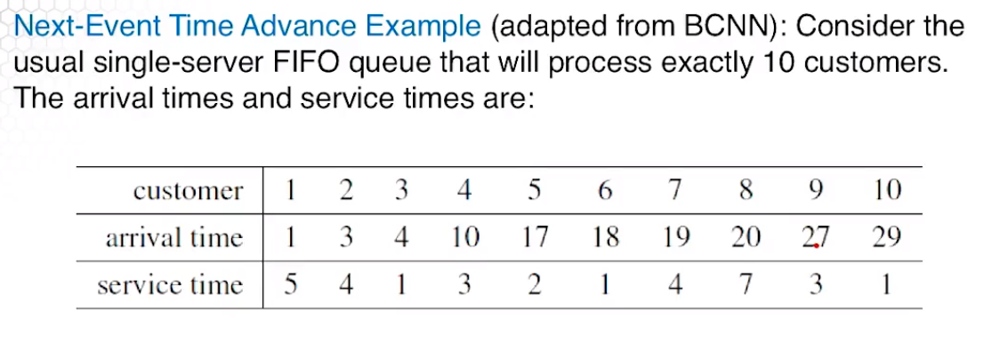
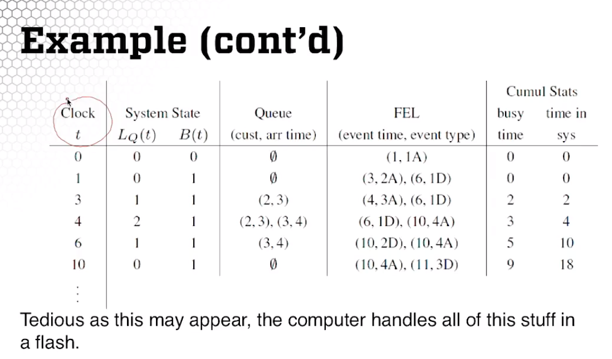
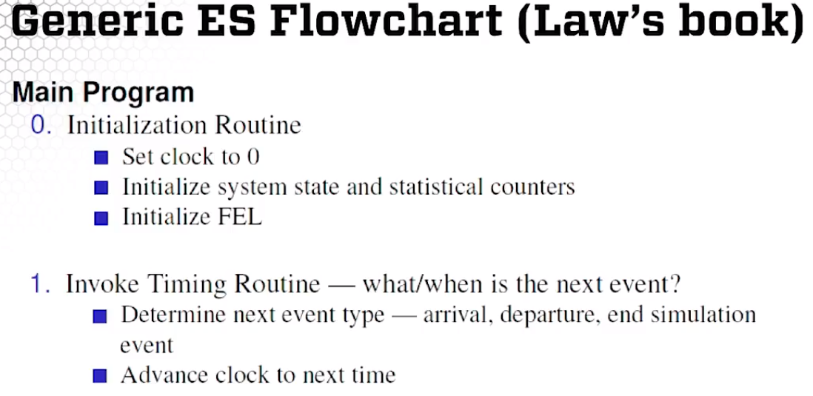
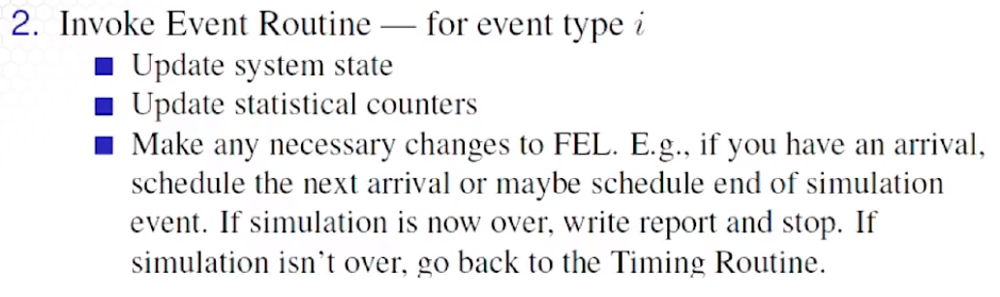
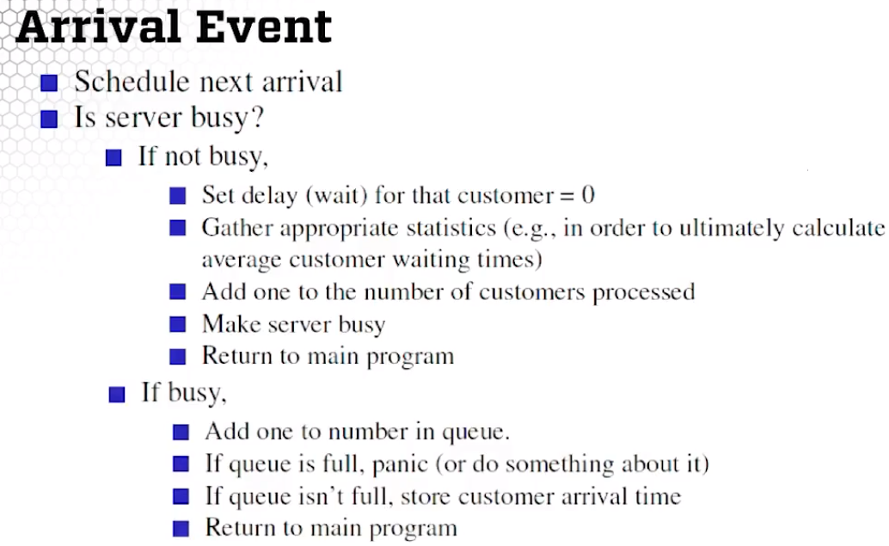
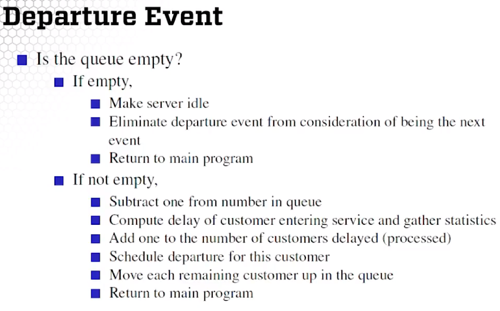

# 4. General Simulation Principles

### Steps in a simulation study

1. **Problem formulation**. Statement of problem.
    1. Profits are too low. What to do?
    2. Customers are complaining about the long lines. Help!
2. **Objectives and Planning**. What specific questions to answer.
    1. How many workers to hire?
    2. How much buffer space to insert in the assembly line?
3. **Model Building**. Both and art and a science.
    1. M/M/k queuing model?
    2. Need physics equations?
4. **Data Collection**. What kinds of data, how much?
    1. Continuous? Discrete?
    2. What exactly should be collected?
    3. Budget considerations.
5. **Coding**. Decide on language to write program.
6. **Verification**. Is the code OK? If not, go back to step 5 (Coding).
7. **Validation**. Is your model OK? If not, go back to step 3 (Modeling)
and 4 (Data Collection).
8. **Experimental Design**. What experiments need to be run to efficiently
answer our questions.
    1. Statistical considerations
    2. Time/budget
9. **Run Experiments**. Press "Go" button on your simulation. May require more time.
10. **Output Analysis**. Statistical analysis, estimate relevant measures of performance.
    1. Often iterative with 8 (Experimental Design) and 9 (Production Runs)
    2. Almost always need more runs.
11. **Make Reports, Implement, and Make Management Happy**

### Useful definitions

1. **System**. Collection of *entitites* (people, machines, etc.) that interact
together to accomplish a goal.
2. **Model**. Abstract representation of a system. Math/logical relationship of the system.
3. **System state**. Set of variables that contain enough information to describe the system. 
Think of the state as a 'snapshot' of the system.
4. **Entities**. Things in the system that can be *permanent* (like a machine) or *temporary* (e.g. customers)
and have various properties or *attributes* (e.g. speed of a server).
5. **List (or Queue)**. Ordered list of associated entities (for instance, a linked list, or a line of people).
6. **Event**. Is a point in time at which the system state changes (and which can't be predicted with
certainty beforehand).
7. **Activity**. Duration of time of *specified length (aka unconditional wait)*. Examples include:
exponential customer interarrival times, constant service times.
8. **Conditional wait**. Duration of time of unspecified length. E.g. customer waiting time.

### Simulation Clock
 The **simulation clock** is a variable whose value represents simulated time (which doesn't equal real time).
 **Time-Advance Mechanisms** tell us how the simulation clock move. 
 
 For our purposes, the simulation clock **always moves forward (never goes back in time)**. It moves in two ways:
 1. ***Fixed-Increment Time Advance***
 2. ***Next-Event Time Advance***
 
 #### Fixed-Increment Time Advance
 It updates the state of the system at fixed times, *nh*, *n = 0,1,2,...* where *h* is chosen appropiately.
 Lets pretend *h* is a one minute increment. Then it updates the state of the system at fixed times 
 1 min, 2 min, 3 min,...
 
 This type of increment is used mostly in **continuous-time models** (e.g. differential equations)
 and models where data are only available at fixed times (e.g. at the end of every month). **Not emphasized in this course!**
 
 #### Next-Event Time Advance
 The clock is initialized at 0. All known future event times are determined and placed in the ***future events list (FEL)***,
 ordered by time.
 
 With this type of time advance, the clock does not move continuously but rather **advances to the most *imminent
 event*, then to the next most imminent event, etc.** 
 
 At each event, the system state and FEL are updated.
 
 ##### Notes on FEL
 * The system state can only change at event times. Nothing really happens between events.
 * The simulation progresses by sequentially executing (dealing with) the most imminent event on the FEL.
 * Need efficient list processing (e.g. *linked lists*) for the FEL.
 * Be careful about events that take place at the same time. Simply establish ground rules for how to 
 deal with ties.
 ###### Updating the FEL
 What do we mean by "updating the FEL"?
 
 Any time there's an event, the simulation may update the chronological order of the FEL's events by:
 * inserting new events; 
 * deleting events; 
 * moving them around; or
 * do nothing.
 
#### Example

 
### Simulation Approaches
##### Event-Scheduling
 This approach focuses on the events and how all these events affect the system state. What happens is that 
 the simulation evolves over time so we have to **track every event in increasing order of time of occurence,
 which is a hassle**. 
 
 You might use this approach if you were programming in C++ or Python from scratch. 
 

**What to do with arrival and departure events**

