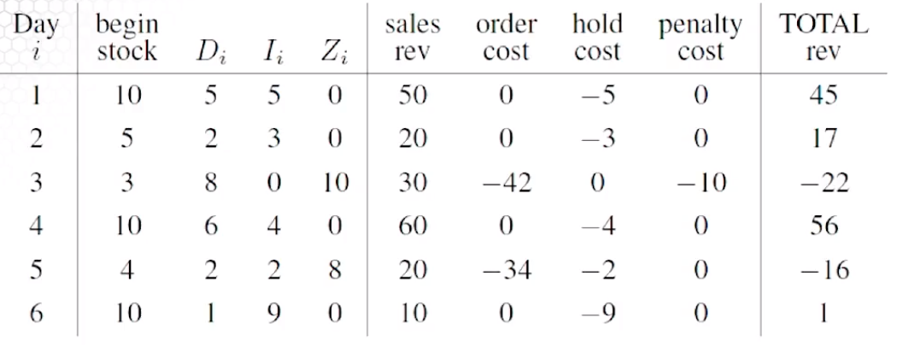

# (s,S) Inventory System

## Description of our problem
* Let´s suppose that a store sells a product at *$d* dollars per unit.
* Our inventory policy is to have at least *s* units in stock at the start of each day.
* If the stock slips to less than *s* by the end of the day, we place an order with our supplier to
push the stock back up to *S* by the beginning of the next day.
* We have various costs

## Notation
Let *Ii* denote the inventory at the end of day *i*, and let *Zi* denote the
order that we place at the end of day *i*.

If an order is placed to the supplier at the end of day *i*, it costs the store:

Where *K* is the cost the store incurs only for calling their supplier (sort of like a fixed cost for
supplying). In addition, you have to pay a unit cost of *cZi*. Moreover, it costs *$h/unit* for the store to hold unsold inventory overnight, and a penalty cost of *$p/unit*
if demand can´t be met. No backlogs are allowed. Demand on the day *i* is *Di*. Note that
*Di* is the only random variable in the model.

## Model

## Example
Suppose:

|variable|value|
|--------|-----|
|*d*     |10   |
|*s*     |3    |
|*S*     |10   |
|*K*     |2    |
|*c*     |4    |
|*p*     |2    |

Consider the following sequence of demands:

|Demand         |value|
|---------------|-----|
|*D1*|10   |
|*D2*|3    |
|*D3*|10   |
|*D4*|2    |
|*D5*|4    |
|*D6*|2    |

In addition, suppose that we start out with an initial stock of *I0 + Z0 = 10*.

