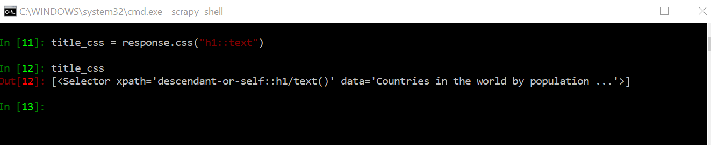

# Web scraping

In order to perform the web scraping, we need to install the following
libraries:
* **scrapy** (version 1.6);
* **pylint**; and
* **autopep8**

After that, run a virtual environment (you can run it on the Anaconda
Navigator).

After installing the packages, open the terminal in Anaconda Navigator. 

If you enter on the Terminal "scrapy" the Terminal will show several commands: 

#### Commands

|Command|What it does|
|--------|-----|
|*bench*     |Run benchmark test to show how fast scrapy can work on your machine   |
|*fetch*     |Fetch (get) the html url of the chosen website **command: fetch (url)**   |
|*genspider*     |This command is used to generate or scaffold a spider using a template   |
|*runspider*     |Create a spider without creating a project     |
|*settings*     |Show default settings    |
|*shell*     |**Important command.** Used to do some experiments with the website before running the spider  |
|*startproject*     |Used to scaffold (set) a project    |
|*version*     |Print scrapy version    |
|*view*     |Open website of your choice on Chrome. Not recommended to use.    |

### Set up project

To set the project, it is recommended to first make a directory in which you're going to save all the project files.
After creating and changing directory, lets create the project with scrapy using
 
 **scrapy startproject [name of the project]**  
 
 
 
 The result of this code is that scrapy created two files: 
 1. a file with the name of the project; 
 2. a file named scrapy.cfg

Inside the newly created folder, we have several files 
 
 
 
 ### Create a spider

To create a spider, first change directory to the folder you just created with *startproject*. The command to create a spider is: 

**scrapy genspider [how we want to name the spider] [url we want to scrap]**

**IMPORTANT:** When we paste the URL of the website we want to scrap in the code above, remove the last "/", as well as the "http(s)//"

Now we have a "countries.py" spider on the spiders folder: 

### Inside of a spider
If we open the spider we just created, it looks something like this: 

As you can see, the spider is a class object. 

|Variable|Meaning|
|--------|-----|
|*name*     |how we named the spider. **IMPORTANT:** A project can have multiple spiders, so it is important to give a unique name to each one of them.   |
|*allowed_domains*     |this variable must contain all the domain names that this spider must be able to access and scrape. **IMPORTANT:** NEVER put the "http(s)://" protocol at the begining of this variable.   |
|*start_urls*     |the URLS the spider will scrape. **IMPORTANT:** scrapy by default sets the protocol as "http://", but if the website you want to scrape uses the https protocol add the "s".   |

Inside the class object, we get a **parse method**. This method parses the response we get back
from the spider.

### how spiders see websites
It is important to know how spiders see websites. They basically see the websites **without** the JavaScript.
To view a website without Javascript:
1. Access on Chrome to the inspect page (CTRL + SHIFT + I)

2.  Press (CTRL + SHIFT + P) and type "JavaScript". Choose the second option "Disable JavaScript"

3.  Refresh the page
### scrapy shell
The teacher recommended to install the ipython package. (I'm not sure why).

The command to start scrapy shell on the Terminal is: 

**scrappy shell**

At the end of the Terminal we can see that this command gave us a list of useful shortcuts we will use commonly.

|Shortcut|Meaning|
|--------|-----|
|*fetch(url[, redirect = True])*     ||
|*fetch(req)*     ||
|*shelp*     ||
|*view(response)*     |View a webpage in a browser|

#### method 1 to open a url on the shell: fetch(url)

The "GET" we see in the results from using fetch is the type of the request that was sent. 
* 404 is the response status code, meaning that scrapy was not able to find a robots.txt file on the website
* 200 is the response that means scrapy was able fulfill a request for this url. 

#### method 2 to open a url on the shell: constructing a request object

If we wanted to obtain the html contents of the webpage we can do it with the command 

**response.body**

## Element selection with xpath and css selector
Suppose we want to select the title from the world population by country website.

The first thing we need to do is to disable JavaScript on the browser. 
We do this because scrapy will return raw html markup without JavaScript. So we
in order to see the website like scrapy does, we disable JavaScript.

#### xpath
In this website, the tag "//h1" is the one which gives us the title. There are cases where the same tag
give us more than one result, and in that case you will need to filter further. 

To get the selector of the title, we use the command: 

**response.xpath("filter used to get the section")**

If we want to get only the text and not the markup, we use the expression ***/text()*** in combination with ***.get()***

Now, suppose we want to get the names of all the countries. When we select a country name with the browser selector, 
we get the label *//a*.

Here, the problem is that not only the countries have this label, so if we use only this label we will select more values than the countries names.

Notice that we want all labels *//a* that are inside the *//td* element. So we change the xpath to ***//td/a*** 

Here, because we are selecting more than one text, we need to use the method ***.getall()***

#### css selector

To get the selector of the title, we use the command: 

**response.css("filter used to get the section")**

to get the text, we also use the ***.get()*** method

### modifying the spider 
After looking at the website with scrapy shell, we now proceed to modify the spider named countries that we created before.

We modify the parse method inside the spider, with the xpath selectors we got previously

In scrapy, if you want to return the data, you need to return it as a dictionary. That is why we use the **yield**
function with the dictionary format.

**IMPORTANT:** to execute the spider, you need to make sure you are on the same level as the "scrapy.cfg" file

Now, to execute the spider, on the Terminal you write the command

**scrapy crawl (name of spider previously created)**

### modifying the spider PT.2  
lets modify more the parse method of the spider. 

First, lets stop scraping the title. Then, for the countries variable we previously obtained only the text of the xpath
selector used. However, if we go to the website

We can see that from the *a* element we can scrape the *a* element and then we can obtain the name by 
extracting the text content of that element as shown before. 

So, instead of extracting only the text, now we modify the selector to only *//td/a*, in order to extract
the href element and the text element.

If we leave the countries response xpath, we will get a list of select objects, which will represent each a node.

Each selector objects on the list, have a data attribute that represents the full *a* element.

**Since each country is a selected object, we can execute an xpath expression against it**

**IMPORTANT RULE:** When we are executing an xpath expression against a selected object, we ALWAYS start with
"***.//***".

Saving and executing the spider gives us: 

As we can see, now we have a dictionary with the info from each country of: 
* name; and 
* link of the country's website

